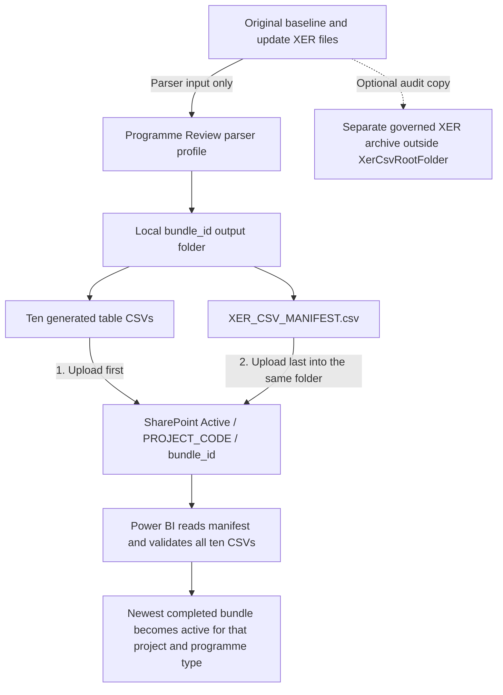

# SharePoint CSV setup for Programme Review

This guide explains how to make a complete project history available to Programme Review from SharePoint CSV files. CSV ownership is **whole-project replacement**: when a project is listed in `XerCsvProjectCodes`, all ten imported XER tables for that project come from its selected SharePoint bundle and Athena is excluded for that project. Projects not listed in `XerCsvProjectCodes` continue to use Athena.

## 1. Prerequisites

Before enabling CSV loading, confirm the following:

- You may use the same SharePoint/OneDrive site already held in `SharePointSite`. Leave `XerCsvSiteUrl` blank to reuse it automatically.
- A team site remains preferable for long-term shared ownership, but it is not required by the loader. If you use the existing personal OneDrive site, refresh depends on that account retaining access and remaining active.
- The account used by Power BI Desktop and Power BI Service can read the document library and every folder beneath the configured CSV root.
- Prefer a durable organisational or service account for Power BI Service refresh. Do not rely on an account that may leave the project or lose access.
- The people publishing bundles need permission to create folders, upload files and move superseded bundles to `Archive`. The refresh account itself only needs read access unless it is also used to publish bundles.
- Every CSV-owned project exists in governed `dbo_project` data and has a project-specific entry in `dbo_userpermission`. The manifest never grants report access; the existing RLS role remains authoritative.
- The XER parser has generated a completed **Programme Review** bundle. Do not use the parser's legacy Enhanced export for this connection.

The existing `SharePointSite` currently uses a personal SharePoint/OneDrive site. That is supported because the report already accesses its `Documents` library through `SharePoint.Contents`. A team-site URL would normally look like:

```text
https://<tenant>.sharepoint.com/sites/<team-site>
```

Do not use any of these as `XerCsvSiteUrl`:

- a URL containing `/Shared Documents/` or `/Forms/AllItems.aspx`;
- a link copied from the Share button;
- the URL of an individual CSV file or bundle folder.

When reusing the current site, keep the site-root URL already stored in `SharePointSite`; do not replace it with a copied folder or sharing-link URL.

## 2. Create the SharePoint folders

1. Open the SharePoint/OneDrive site stored in `SharePointSite`.
2. Open its **Documents** library. If you later override the site, open the library whose exact connector name is stored in `XerCsvLibrary`.
3. Open the existing `P6` folder. Create it if it does not already exist.
4. Open `P6` and create `XER CSV`.
5. Open `XER CSV` and create two folders: `Active` and `Archive`.
6. Under both `Active` and `Archive`, create one uppercase folder for each manual project. The name must match the bundle manifest's `project_code`.

For example, two manual projects must be separated as follows:

```text
Documents/
└─ P6/
   └─ XER CSV/
      ├─ Active/
      │  ├─ C5001/
      │  └─ C5002/
      └─ Archive/
         ├─ C5001/
         └─ C5002/
```

Do not mix bundles from different projects in one project folder. Do not place the ten CSV files directly in `C5001` or `C5002`; each export must retain its parser-generated `<bundle_id>` folder.

The original `.xer` files do **not** belong anywhere beneath `XER CSV/Active`. They are inputs to the parser, not files read by this Power BI connection. If the original XERs must be retained for audit, keep them in a separate governed archive outside `XerCsvRootFolder`.

If **New > Folder** is unavailable, ask the SharePoint library owner to enable folders or grant the required permission. Microsoft documents the current folder procedure in [Create a folder in a document library](https://support.microsoft.com/en-US/SharePoint/documents-and-library/create-a-folder-in-a-document-library).

## 3. Publish a Programme Review bundle

The parser creates one immutable full-history bundle for one project and one programme type. A bundle name follows this pattern:

```text
<PROJECT>_<C|T>_<yyyyMMddTHHmmssZ>_<hash8>
```

### The short answer: which files share a folder?

The ten generated CSV files and `XER_CSV_MANIFEST.csv` are uploaded into the **same `<bundle_id>` folder**. The manifest is not stored in a separate manifest folder. Upload the ten CSVs first and upload the manifest into that same folder last.

The original `.xer` files are **not uploaded into the bundle**. The manifest records their names and hashes for audit, but Power BI does not need the original XER binaries in the SharePoint CSV location.

| Item | Place inside `Active/<PROJECT_CODE>/<bundle_id>`? | Publication rule |
|---|---:|---|
| Original `.xer` input files | No | Keep locally or in a separate governed XER archive outside `XerCsvRootFolder` |
| Ten parser-generated table CSVs | Yes | Upload first, all into the same `<bundle_id>` folder |
| `XER_CSV_MANIFEST.csv` | Yes | Upload into the same `<bundle_id>` folder, but upload it last |
| Web download `<bundle_id>.zip` | No | Extract the ZIP and upload the inner bundle files; never upload the ZIP itself |
| Any extra notes, copies or subfolders | No | A completed bundle must contain exactly the eleven required files |

### Publication flow



The resulting SharePoint structure for one project is:

```text
Documents/
└─ P6/
   └─ XER CSV/
      └─ Active/
         └─ C5001/                                  ← project folder
            └─ C5001_C_20260830T012345Z_a1b2c3d4/   ← one bundle folder
               ├─ 01_XER_TASK.csv
               ├─ 02_XER_PROJECT.csv
               ├─ 03_XER_PROJWBS.csv
               ├─ 06_XER_PREDECESSOR.csv
               ├─ 07_XER_ACTVTYPE.csv
               ├─ 08_XER_ACTVCODE.csv
               ├─ 09_XER_TASKACTV.csv
               ├─ 10_XER_CALENDAR.csv
               ├─ 12_XER_RSRC.csv
               ├─ 15_XER_RESOURCE_DISTRIBUTION.csv
               └─ XER_CSV_MANIFEST.csv              ← same folder; uploaded last
```

There must be no `.xer`, `.zip`, notes, duplicate CSVs or child folders inside the completed `<bundle_id>` folder. Extra content makes the bundle invalid and stops refresh.

Publish it as follows:

1. In the Windows parser, add the complete history and choose **Create Programme Review bundle**. In the web parser, choose the **Programme Review** export profile and then **Create Programme Review Bundle**.
2. Confirm the local output contains exactly the ten table CSVs listed below plus `XER_CSV_MANIFEST.csv`. The web parser downloads a ZIP: extract it first and use the inner parser-generated `<bundle_id>` folder. Do not upload the ZIP file to SharePoint.
3. In SharePoint, open `Active/<PROJECT_CODE>` and create or upload a folder using the exact parser-generated `<bundle_id>`.
4. Upload the ten table CSVs first. Wait until SharePoint shows that all ten uploads have completed.
5. Upload `XER_CSV_MANIFEST.csv` separately and last. The loader ignores a staging folder without a manifest, which prevents it from selecting a partially uploaded bundle.
6. Do not rename the bundle folder, manifest or table files after publication.

Required files:

```text
01_XER_TASK.csv
02_XER_PROJECT.csv
03_XER_PROJWBS.csv
06_XER_PREDECESSOR.csv
07_XER_ACTVTYPE.csv
08_XER_ACTVCODE.csv
09_XER_TASKACTV.csv
10_XER_CALENDAR.csv
12_XER_RSRC.csv
15_XER_RESOURCE_DISTRIBUTION.csv
XER_CSV_MANIFEST.csv
```

Before activation, open the manifest and verify:

- `bundle_status` is `complete`;
- `project_code` matches the parent SharePoint project folder;
- `programme_type` is `C` or `T` as required;
- `bundle_id` matches the bundle folder exactly;
- every source XER has one manifest row for each of the ten table names.

Only validated completed bundles may remain beneath `Active/<PROJECT_CODE>`. The loader validates every manifest-bearing child bundle before selecting the newest one, so an invalid older bundle can stop refresh. Move malformed or superseded bundles to `Archive/<PROJECT_CODE>`. A manifest-free staging folder is safely ignored until publication is complete.

Microsoft's supported upload methods are described in [Upload files and folders to a library](https://support.microsoft.com/en-US/SharePoint/documents-and-library/upload-files-and-folders-to-a-library). Upload the manifest separately even if folder drag-and-drop is available.

## 4. Configure Power BI Desktop parameters

Open `Project Review - Programme (datalake).pbip` in Power BI Desktop. Open **Transform data**, then **Manage parameters** or **Edit parameters**, depending on the Desktop view.

Configure the parameters in this order and set `XerCsvEnabled` last:

| Parameter | Example | Purpose |
|---|---|---|
| `XerCsvSiteUrl` | Leave blank | Blank reuses `SharePointSite`; enter a site-root URL only when deliberately overriding it |
| `XerCsvLibrary` | `Documents` | Exact library name on the existing site; use `Shared Documents` only if that is the name returned for another site |
| `XerCsvRootFolder` | `P6/XER CSV/Active` | Path below the library; no site URL |
| `XerCsvProjectCodes` | `C5001, C5002` | Comma-separated project folders owned by CSV |
| `SelectedProjects` | `C5001, C5002, C5003` | Overall report scope; must include every CSV-owned project |
| `SelectedProgrammeType` | `C` | `C`, `T`, or `ALL` |
| `XerCsvEnabled` | `true` | Activates project-folder navigation and CSV ownership |

Important rules:

- `XerCsvProjectCodes` is an explicit allow-list. A project folder that exists in SharePoint but is not listed remains unused.
- When `XerCsvSiteUrl` is blank, the CSV loader automatically uses the existing `SharePointSite` value. This is the recommended setting when you want both queries to use the same site and credential scope.
- `XerCsvLibrary` is still separate because different sites expose their document library as `Documents` or `Shared Documents`. The current report's existing site uses `Documents`.
- Project codes can contain only `A-Z`, `0-9` and `_`. Spaces and punctuation are not valid routing tokens.
- Do not enter both the C and J alias for the same numeric project, such as both `C5001` and `J5001`. The loader excludes both Athena aliases when either one is routed.
- The code in `XerCsvProjectCodes`, the SharePoint parent folder and manifest `project_code` must be identical. The parent folder must use the exact uppercase code. C/J equivalence applies only to selected-project scope, governance and Athena exclusion; it does not make `Active/C5001` interchangeable with `Active/J5001`.
- `SelectedProjects` must include every routed project. C/J aliases count as the same governed identity for this scope check.
- If `SelectedProgrammeType = ALL`, every routed project needs a completed C bundle and a completed T bundle beneath its project folder.
- If `XerCsvEnabled = false`, or `XerCsvProjectCodes` is blank, the report remains Athena-only and does not evaluate `SharePoint.Contents`.

`SharePoint.Contents` starts from a SharePoint site and navigates its folders and documents. Microsoft documents the connector at [SharePoint.Contents](https://learn.microsoft.com/en-us/powerquery-m/sharepoint-contents) and [SharePoint and OneDrive files](https://learn.microsoft.com/en-us/power-query/sharepoint-onedrive-files).

## 5. Configure Desktop credentials and privacy

1. In Power BI Desktop, select **File > Options and settings > Data source settings**.
2. Select the SharePoint site used by the CSV loader. When `XerCsvSiteUrl` is blank, this is the existing `SharePointSite` source.
3. Select **Edit Permissions** and sign in with **Organizational account**.
4. Set the SharePoint privacy level to **Organizational**.
5. Select the existing Athena source and confirm it also uses the approved organisational credentials and **Organizational** privacy level.
6. If Desktop retains an obsolete SharePoint site or account, select that entry, choose **Clear Permissions**, close the dialog, refresh, and sign in again when prompted.
7. Apply the parameters and run a full refresh.

Do not select **Ignore privacy levels** as a production fix. Microsoft explains the Desktop controls in [Power BI Desktop privacy levels](https://learn.microsoft.com/en-us/power-bi/enterprise/desktop-privacy-levels) and the effect of combining sources in [Privacy levels in Power Query](https://learn.microsoft.com/en-us/power-query/privacy-levels).

After refresh, verify source ownership:

- every `task_id_key` for a CSV-owned project starts with `CSV|`;
- no `task_id_key` for an Athena-owned project starts with `CSV|`;
- every configured project has its baseline and expected updates;
- project, WBS, predecessor, activity-code, calendar and resource visuals return data without relationship errors.

Because ownership is whole-project, an Athena copy of update `2608` is intentionally ignored when that project is listed in `XerCsvProjectCodes`. The selected CSV bundle owns the complete project history.

## 6. Configure Power BI Service

1. Publish to a test workspace before changing the production report.
2. Open the semantic model in the workspace and open **Settings**.
3. Confirm the semantic-model owner is the durable account intended to maintain refresh credentials. Take over the model only if authorised and necessary.
4. Under **Gateway and cloud connections**, retain or map the report's existing Athena connection and gateway path.
5. Under **Data source credentials** or the corresponding SharePoint cloud connection, sign in to the team SharePoint site with OAuth/Organizational account credentials.
6. Confirm the published parameter values, especially `XerCsvSiteUrl`, `XerCsvProjectCodes` and `XerCsvEnabled`.
7. Run an on-demand refresh and review **Refresh history** before enabling or changing the schedule.
8. After a successful on-demand refresh, configure the refresh frequency, time zone and failure notifications.

SharePoint Online is a cloud source and ordinarily does not need an on-premises gateway when Power BI Service can connect to it directly. Keep the existing Athena connection path unchanged. If the semantic model combines a gateway-backed Athena source with the SharePoint cloud source, the Power BI or gateway administrator may need to approve the cloud connection mapping for that gateway cluster.

Microsoft documents the current Service sections and refresh process in [Configure scheduled refresh](https://learn.microsoft.com/en-us/power-bi/connect-data/refresh-scheduled-refresh) and [Data refresh in Power BI](https://learn.microsoft.com/en-us/power-bi/connect-data/refresh-data).

## 7. Replace, archive or roll back a bundle

### Replace a project bundle

1. Generate a new full-history bundle for the same project and programme type.
2. Publish it beneath the same `Active/<PROJECT_CODE>` folder, with the manifest uploaded last.
3. Refresh in Desktop or the test workspace.
4. Confirm the new history, baseline, previous period, logic, activity codes, calendars and resources.
5. Move the superseded bundle to `Archive/<PROJECT_CODE>` only after the new refresh succeeds.

The loader selects the completed bundle with the newest `exported_at_utc`; `bundle_id` is the deterministic tie-breaker.

### Roll back

1. Move the newest bundle from `Active/<PROJECT_CODE>` to `Archive/<PROJECT_CODE>`.
2. Move the required preceding completed bundle from `Archive/<PROJECT_CODE>` back to `Active/<PROJECT_CODE>`. If it was deliberately retained in `Active`, confirm it is still present instead.
3. Refresh the semantic model. The restored bundle will be selected automatically.

### Emergency disable

Set `XerCsvEnabled = false` and refresh. This disables all CSV routing and returns the report to Athena-only operation without contacting SharePoint.

## 8. Troubleshooting

| Error or symptom | Likely cause | Corrective action |
|---|---|---|
| `No active SharePoint project folder exists` | A code in `XerCsvProjectCodes` has no matching child folder beneath `Active` | Create `Active/<PROJECT_CODE>` or correct the parameter |
| `More than one active SharePoint project folder matches` | Duplicate or case-variant project folders are visible to the connector | Keep one project folder and archive or rename the duplicate |
| `A completed bundle manifest does not match its parent` | A bundle was uploaded beneath the wrong project folder | Move it to the project folder matching manifest `project_code` |
| `The SharePoint project folder must use the exact uppercase project code` | The folder differs in case or spelling from `XerCsvProjectCodes` | Rename the parent folder to the exact uppercase configured code and keep manifest `project_code` identical |
| `No completed active CSV bundle exists` | Manifest missing, wrong programme type, or no complete bundle for a required C/T pair | Complete the upload and add the manifest last; check `SelectedProgrammeType` |
| `Unsupported schema_version` | Bundle came from an incompatible parser profile | Regenerate using the supported Programme Review profile |
| `Manifest headers or header order do not match` | Manifest was manually edited or created by another process | Regenerate the bundle; do not edit contract files manually |
| `CSV headers or header order do not match` | Wrong export profile or renamed columns | Regenerate using Programme Review Bundle |
| `Do not configure both C and J aliases` | Both aliases are present in `XerCsvProjectCodes` | Keep only the folder/manifest project code |
| `Every routed CSV project must also be included by SelectedProjects` | The overall report scope excludes a CSV-owned project | Add the project or its recognised C/J alias to `SelectedProjects` |
| `CSV routing is blocked ... absent from governed dbo_project` | Governed project metadata is missing | Have the data owner add or correct the project record before activation |
| `CSV routing is blocked ... no governed dbo_userpermission` | No project-specific governed permission exists | Have the security/data owner add the permission record; never use the manifest to bypass RLS |
| `Access denied`, `401` or `403` | Account lacks SharePoint access or OAuth credentials expired | Confirm site/library permission and re-enter Organizational credentials |
| Folder or library cannot be found | The resolved site URL, `XerCsvLibrary` or `XerCsvRootFolder` is wrong | When reusing the existing site, leave `XerCsvSiteUrl` blank and use `Documents`; otherwise use the override site root, exact library name and path below the library |
| `Formula.Firewall` or privacy error | Athena and SharePoint privacy levels differ or are unset | Set both approved sources to `Organizational` in Desktop and Service |
| Desktop succeeds but Service fails | Service credentials, ownership, parameters or gateway mapping differ | Review semantic-model settings, cloud/gateway connections and Refresh history |
| New bundle is not selected | Manifest not uploaded, bundle status incomplete, or `exported_at_utc` is older | Validate the manifest and selected programme type; do not rename the bundle |
| A newer valid bundle exists but refresh still fails | An older manifest-bearing bundle beneath `Active/<PROJECT_CODE>` is invalid | Move the invalid bundle to `Archive/<PROJECT_CODE>`; leave only validated completed bundles and manifest-free upload staging folders in `Active` |
| Refresh shows no SharePoint request | CSV mode is disabled or project list blank | Set the site parameters and project list, then enable `XerCsvEnabled` |

Do not solve validation failures by removing manifest rows, changing hashes, renaming key prefixes or disabling RLS. Correct the source bundle or configuration instead.

## 9. Go-live checklist

- [ ] The resolved SharePoint site and exact `XerCsvLibrary` name are confirmed (`Documents` for the existing `SharePointSite`).
- [ ] `P6/XER CSV/Active` and `P6/XER CSV/Archive` created.
- [ ] Every manual project has its own matching folder under both roots.
- [ ] Bundle contains exactly ten table CSVs and one manifest.
- [ ] Table CSVs uploaded first and manifest uploaded last.
- [ ] `project_code`, bundle ID and programme type match their folder locations.
- [ ] Project exists in `dbo_project` and has governed `dbo_userpermission` data.
- [ ] Desktop parameters checked and `XerCsvEnabled` enabled last.
- [ ] Athena and SharePoint privacy levels set to `Organizational`.
- [ ] Desktop full refresh succeeds.
- [ ] CSV-owned projects contain only `CSV|` relationship keys.
- [ ] Athena-owned projects contain no `CSV|` relationship keys.
- [ ] Baseline, previous update, logic, WBS, codes, calendars and resources checked.
- [ ] RLS tested with **View as** and a real low-privilege account.
- [ ] Service owner, credentials, gateway/cloud mappings and parameters checked.
- [ ] On-demand Service refresh succeeds before scheduled refresh is enabled.
- [ ] Bundle replacement and rollback tested in the test workspace.
