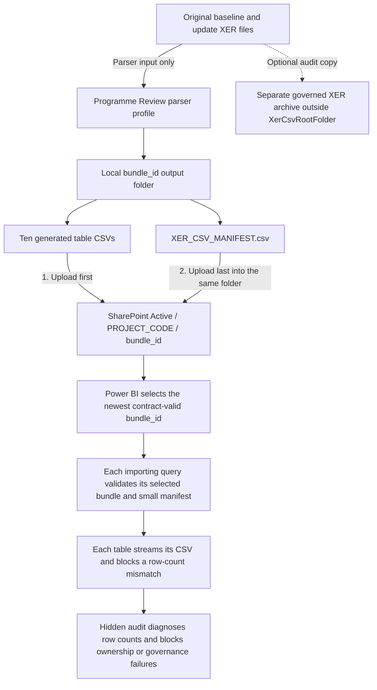

# SharePoint CSV setup for Programme Review

This guide explains how to make a complete project history available to Programme Review from SharePoint CSV files. CSV ownership is **whole-project replacement**: when a project is listed in `XerCsvProjectCodes`, all ten imported XER tables for that project come from its selected SharePoint bundle and Athena is excluded for that project. Projects not listed in `XerCsvProjectCodes` continue to use Athena.

## 1. Prerequisites

Before enabling CSV loading, confirm the following:

- `SharePointSite` contains the SharePoint/OneDrive site-root URL used by both the report's external assets and CSV loader. It is required and cannot be a local Windows or synchronised OneDrive path.
- A team site remains preferable for long-term shared ownership, but it is not required by the loader. If you use the existing personal OneDrive site, refresh depends on that account retaining access and remaining active.
- The account used by Power BI Desktop and Power BI Service can read the document library and every folder beneath the configured CSV root.
- Prefer a durable organisational or service account for Power BI Service refresh. Do not rely on an account that may leave the project or lose access.
- The people publishing bundles need permission to create folders, upload files and move superseded bundles to `Archive`. The refresh account itself only needs read access unless it is also used to publish bundles.
- Every CSV-owned project exists in governed `dbo_project` data and has a project-specific entry in `dbo_userpermission`. The manifest never grants report access; the existing RLS role remains authoritative.
- The XER parser has generated and validated a completed **Programme Review** schema `3.0` bundle. Schemas `1.0` and `2.0` are accepted only for migration or rollback. Do not use the parser's legacy Enhanced export for this connection.

The existing `SharePointSite` currently uses a personal SharePoint/OneDrive site. That is supported because the report already accesses its `Documents` library through `SharePoint.Contents`. A team-site URL would normally look like:

```text
https://<tenant>.sharepoint.com/sites/<team-site>
```

Do not use any of these as `SharePointSite`:

- a URL containing `/Shared Documents/` or `/Forms/AllItems.aspx`;
- a link copied from the Share button;
- the URL of an individual CSV file or bundle folder.

Keep the site-root URL in `SharePointSite`; do not replace it with a copied folder or sharing-link URL.

## 2. Create the SharePoint folders

1. Open the SharePoint/OneDrive site stored in `SharePointSite`.
2. Open the library whose exact connector name is stored in `XerCsvLibrary` (`Documents` for the current site).
3. Open the existing `P6` folder. Create it if it does not already exist.
4. Open `P6` and create `XER CSV`.
5. Open `XER CSV` and create two folders: `Active` and `Archive`.
6. Under both `Active` and `Archive`, create one uppercase folder for each manual project. The name must match the bundle manifest's `project_code`.

For example, two manual projects must be separated as follows:

```text
Documents/
└─ P6/
   └─ XER CSV/
      ├─ Active/
      │  ├─ C5001/
      │  └─ C5002/
      └─ Archive/
         ├─ C5001/
         └─ C5002/
```

Do not mix bundles from different projects in one project folder. Do not place the ten CSV files directly in `C5001` or `C5002`; each export must retain its parser-generated `<bundle_id>` folder.

The original `.xer` files do **not** belong anywhere beneath `XER CSV/Active`. They are inputs to the parser, not files read by this Power BI connection. If the original XERs must be retained for audit, keep them in a separate governed archive outside `XerCsvRootFolder`.

If **New > Folder** is unavailable, ask the SharePoint library owner to enable folders or grant the required permission. Microsoft documents the current folder procedure in [Create a folder in a document library](https://support.microsoft.com/en-US/SharePoint/documents-and-library/create-a-folder-in-a-document-library).

## 3. Publish a Programme Review bundle

The parser creates one immutable full-history bundle for one project and one programme type. A bundle name follows this pattern:

```text
<PROJECT>_<C|T>_<yyyyMMddTHHmmssZ>_<hash8>
```

New bundles use manifest schema `3.0` and compact relationship keys in this exact form:

```text
CSV::<project_code>::<programme_type>::<snapshot_tag>::<native_id>
```

The `::` delimiter is required because this report's WBS hierarchy uses DAX `PATH`, which rejects vertical pipe (`|`) inside an identifier. During import, the loader converts schema `1.0` keys (`CSV|<bundle_id>|<canonical_xer_filename>.<native_id>`) and schema `2.0` keys (`CSV::<bundle_id>::<canonical_xer_filename>::<native_id>`) to the same compact model grammar. Do not create new v1/v2 bundles.

### The short answer: which files share a folder?

The ten generated CSV files and `XER_CSV_MANIFEST.csv` are uploaded into the **same `<bundle_id>` folder**. The manifest is not stored in a separate manifest folder. Upload the ten CSVs first and upload the manifest into that same folder last.

The original `.xer` files are **not uploaded into the bundle**. The manifest records their names and hashes for audit, but Power BI does not need the original XER binaries in the SharePoint CSV location.

| Item | Place inside `Active/<PROJECT_CODE>/<bundle_id>`? | Publication rule |
|---|---:|---|
| Original `.xer` input files | No | Keep locally or in a separate governed XER archive outside `XerCsvRootFolder` |
| Ten parser-generated table CSVs | Yes | Upload first, all into the same `<bundle_id>` folder |
| `XER_CSV_MANIFEST.csv` | Yes | Upload into the same `<bundle_id>` folder, but upload it last |
| Web download `<bundle_id>.zip` | No | Extract the ZIP and upload the inner bundle files; never upload the ZIP itself |
| Any extra notes, copies or subfolders | No | A completed bundle must contain exactly the eleven required files |

### Publication flow



The resulting SharePoint structure for one project is:

```text
Documents/
└─ P6/
   └─ XER CSV/
      └─ Active/
         └─ C5001/                                  ← project folder
            └─ C5001_C_20260830T012345Z_a1b2c3d4/   ← one bundle folder
               ├─ 01_XER_TASK.csv
               ├─ 02_XER_PROJECT.csv
               ├─ 03_XER_PROJWBS.csv
               ├─ 06_XER_PREDECESSOR.csv
               ├─ 07_XER_ACTVTYPE.csv
               ├─ 08_XER_ACTVCODE.csv
               ├─ 09_XER_TASKACTV.csv
               ├─ 10_XER_CALENDAR.csv
               ├─ 12_XER_RSRC.csv
               ├─ 15_XER_RESOURCE_DISTRIBUTION.csv
               └─ XER_CSV_MANIFEST.csv              ← same folder; uploaded last
```

There must be no `.xer`, `.zip`, notes, duplicate CSVs or child folders inside the completed `<bundle_id>` folder. Extra content makes the bundle invalid and stops refresh.

Publish it as follows:

1. In the Windows parser, add the complete history and choose **Create Programme Review bundle**. In the web parser, choose the **Programme Review** export profile and then **Create Programme Review Bundle**. The output manifest must use schema `3.0`.
2. Confirm the local output contains exactly the ten table CSVs listed below plus `XER_CSV_MANIFEST.csv`. The web parser downloads a ZIP: extract it first and use the inner parser-generated `<bundle_id>` folder. Do not upload the ZIP file to SharePoint.
3. In SharePoint, open `Active/<PROJECT_CODE>` and create or upload a folder using the exact parser-generated `<bundle_id>`.
4. Upload the ten table CSVs first. Wait until SharePoint shows that all ten uploads have completed.
5. Upload `XER_CSV_MANIFEST.csv` separately and last. The loader ignores a staging folder without a manifest, which prevents it from selecting a partially uploaded bundle.
6. Do not rename the bundle folder, manifest or table files after publication.

Required files:

```text
01_XER_TASK.csv
02_XER_PROJECT.csv
03_XER_PROJWBS.csv
06_XER_PREDECESSOR.csv
07_XER_ACTVTYPE.csv
08_XER_ACTVCODE.csv
09_XER_TASKACTV.csv
10_XER_CALENDAR.csv
12_XER_RSRC.csv
15_XER_RESOURCE_DISTRIBUTION.csv
XER_CSV_MANIFEST.csv
```

Before activation, open the manifest and verify:

- `schema_version` is `3.0` for every new publication;
- `bundle_status` is `complete`;
- `project_code` matches the parent SharePoint project folder;
- `programme_type` is `C` or `T` as required;
- `bundle_id` matches the bundle folder exactly;
- every source XER has one manifest row for each of the ten table names.

The parser's successful publication validation is authoritative for SHA-256 hashes, duplicate keys and full cross-table referential integrity. The report independently validates each selected import envelope, tokens and types. During each table load it sums manifest `row_count` across all source snapshots, counts the corresponding CSV data rows after header validation, and blocks a mismatch before type and key conversion. It does not redownload all ten tables through `01 XER_TASK` to repeat parser validation.

The loader navigates only project folders named in `XerCsvProjectCodes`; additional project folders beneath `Active` are not opened or validated. Within each selected project it ignores manifest-free staging folders, orders manifest-bearing folders by the timestamp embedded in the contract-valid `bundle_id`, then fully validates the newest selected bundle. Schemas `1.0` and `2.0` remain load-compatible, but after a successful v3 replacement move superseded v1/v2/v3 folders to `Archive/<PROJECT_CODE>` to minimise SharePoint enumeration and make rollback choices explicit.

Microsoft's supported upload methods are described in [Upload files and folders to a library](https://support.microsoft.com/en-US/SharePoint/documents-and-library/upload-files-and-folders-to-a-library). Upload the manifest separately even if folder drag-and-drop is available.

## 4. Configure Power BI Desktop parameters

Open `Project Review - Programme (datalake).pbip` in Power BI Desktop. Open **Transform data**, then **Manage parameters** or **Edit parameters**, depending on the Desktop view.

Configure the parameters in this order and set `XerCsvEnabled` last:

| Parameter | Example | Purpose |
|---|---|---|
| `AthenaDsn` | `primary_p6_bi_reporting` | Amazon Athena DSN used by every Athena query |
| `SharePointSite` | `https://<tenant>.sharepoint.com/sites/<team-site>` | Required site-root URL used by both external assets and CSV loading |
| `XerCsvLibrary` | `Documents` | Exact library name returned by `SharePoint.Contents`; use `Shared Documents` only when that is the selected site's connector name |
| `XerCsvRootFolder` | `P6/XER CSV/Active` | Path below the library; no site URL |
| `XerCsvProjectCodes` | `C5001, C5002` | Current CSV-source override; only these project folders are opened |
| `SelectedProjects` | `ALL` | Overall report scope; use `ALL` or a finite comma-separated list |
| `SelectedProgrammeType` | `C` | `C`, `T`, or `ALL` |
| `XerCsvEnabled` | `true` | Activates project-folder navigation and CSV ownership |

Important rules:

- `XerCsvProjectCodes` is an explicit source-ownership allow-list. A project folder that exists in SharePoint but is not listed remains unused, even if its bundle is invalid.
- `AthenaDsn` and `SharePointSite` are the only source-location parameters. Do not hard-code another Athena DSN or SharePoint site in a query.
- Both SharePoint queries use `SharePointSite`, giving them one site and credential scope. `XerCsvLibrary` remains separate because sites can expose their document library as `Documents` or `Shared Documents`.
- Project codes can contain only `A-Z`, `0-9` and `_`. Spaces and punctuation are not valid routing tokens.
- Do not enter both the C and J alias for the same numeric project, such as both `C5001` and `J5001`. The loader excludes both Athena aliases when either one is routed.
- The code in `XerCsvProjectCodes`, the SharePoint parent folder and manifest `project_code` must be identical. The parent folder must use the exact uppercase code. C/J equivalence applies only to selected-project scope, governance and Athena exclusion; it does not make `Active/C5001` interchangeable with `Active/J5001`.
- If `SelectedProjects` is finite, it must include every routed project. C/J aliases count as the same governed identity for this scope check. `SelectedProjects = ALL` already includes every routed project and needs no parameter change when CSV ownership is switched.
- If `SelectedProgrammeType = ALL`, every routed project needs a completed C bundle and a completed T bundle beneath its project folder.
- If `XerCsvEnabled = false`, or `XerCsvProjectCodes` is blank, the report remains Athena-only and does not evaluate `SharePoint.Contents`.

With `SelectedProjects = ALL`, the parameters behave as follows:

| `XerCsvProjectCodes` | CSV source | Athena source |
|---|---|---|
| `C6036` | C6036 | Every other project |
| `CNZ01` | CNZ01 | Every other project, including C6036 when Athena contains it |
| `C6036,CNZ01` | C6036 and CNZ01 | Every other project |

Athena excludes the currently routed code and its recognised numeric C/J alias. After a switch, a former CSV project returns with `IsCsvSource = false` when Athena contains it; if Athena has no records for that project, it contributes zero rows without a routing error. `SelectedProgrammeType = ALL` remains independent and still requires both a completed C bundle and a completed T bundle for every CSV-routed project.

`SharePoint.Contents` starts from a SharePoint site and navigates its folders and documents. Microsoft documents the connector at [SharePoint.Contents](https://learn.microsoft.com/en-us/powerquery-m/sharepoint-contents) and [SharePoint and OneDrive files](https://learn.microsoft.com/en-us/power-query/sharepoint-onedrive-files).

## 5. Configure Desktop credentials and privacy

1. In Power BI Desktop, select **File > Options and settings > Data source settings**.
2. Select the SharePoint source matching `SharePointSite`.
3. Select **Edit Permissions** and sign in with **Organizational account**.
4. Set the SharePoint privacy level to **Organizational**.
5. Select the existing Athena source and confirm it also uses the approved organisational credentials and **Organizational** privacy level.
6. If Desktop retains an obsolete SharePoint site or account, select that entry, choose **Clear Permissions**, close the dialog, refresh, and sign in again when prompted.
7. Apply the parameters and run a full refresh.

Do not select **Ignore privacy levels** as a production fix. Microsoft explains the Desktop controls in [Power BI Desktop privacy levels](https://learn.microsoft.com/en-us/power-bi/enterprise/desktop-privacy-levels) and the effect of combining sources in [Privacy levels in Power Query](https://learn.microsoft.com/en-us/power-query/privacy-levels).

After refresh, verify source ownership:

- every imported XER table's hidden `IsCsvSource` is `true` only for CSV-owned rows and `false` for Athena rows;
- every CSV key follows `CSV::<project_code>::<C|T>::<snapshot_tag>::<native_id>` and no model key contains `|`;
- no `task_id_key` for an Athena-owned project starts with `CSV::`;
- hidden `XER CSV Manifest` contains only the selected bundle metadata and its row totals match the imported model;
- all ten hidden `XER CSV Refresh Audit` records return `PASS`; `DIAGNOSTIC_MISMATCH` is retained only as a secondary calculated reconciliation state, while ownership and governance failures still raise `ERROR()`;
- every configured project has its baseline and expected updates;
- project, WBS, predecessor, activity-code, calendar and resource visuals return data without relationship errors.

The two audit tables and `IsCsvSource` fields are intentionally hidden technical objects; do not bind them to normal report visuals.

Because ownership is whole-project, an Athena copy of update `2608` is intentionally ignored when that project is listed in `XerCsvProjectCodes`. The selected CSV bundle owns the complete project history. Removing that code from the override returns the project to Athena ownership on the next full refresh.

## 6. Publish and configure Power BI Service

### Open and publish the normal PBIP

Use `Project Review - Programme (datalake).pbip` in the repository root for all normal editing, refreshing and publishing. Its previous local Service bindings have been cleared, so no deployment copy or preparation script is required.

Open the normal PBIP, complete and save a full Desktop refresh, then select **Publish**. After the first successful publication, Desktop may recreate ignored `.pbi/localSettings.json` files in this same project. That is expected: continue using the same normal PBIP for later edits and publications to the same destination. Never commit local bindings, `cache.abf`, credentials or PBIX files.

Microsoft documents direct Desktop publication of PBIP projects in [Power BI Desktop projects](https://learn.microsoft.com/en-us/power-bi/developer/projects/projects-overview).

### Create new workspace items

1. Open the normal root `.pbip`, refresh and save it.
2. Select **Publish** and choose the authorised destination workspace.
3. Confirm the destination does not already contain a same-name report or semantic model. An unbound clean copy creates new items.
4. Continue using the same normal root `.pbip` for future updates to these items.

### Replace existing same-name items safely

1. Confirm the destination contains exactly one report and one semantic model with the PBIP display names. Resolve duplicate same-name models before continuing.
2. Record the current report and semantic-model IDs, report URL and sharing links, direct access, Build permissions, RLS memberships, app inclusion and audiences, refresh schedule, gateway mapping, endorsement and sensitivity labels.
3. Open the normal root `.pbip`, complete and save a full refresh, and publish to that same workspace.
4. Continue only when Desktop explicitly offers to **Replace** the existing report and semantic model. Cancel if it proposes creating another item or does not identify the expected pair.
5. Review the impact analysis, retain the existing sensitivity label when prompted, and accept **Replace**. Never delete, recreate or manually rename the existing Service items.
6. Verify that both item IDs and the existing report URL are unchanged, shared links still open, direct and Build access and RLS memberships remain present, and the app still references the report.
7. Update the app only after verification, retaining its audiences and permissions. Test with a normal app consumer account as well as the publisher.
8. Keep using the same normal root `.pbip` for subsequent publications to this destination; Desktop's regenerated local binding remains ignored by Git.

The publisher needs permission to replace both items. Publication can also be blocked by duplicate same-name models or the tenant setting **Block republish and disable package refresh**. See [Publish troubleshooting](https://learn.microsoft.com/en-us/power-bi/create-reports/desktop-troubleshoot-publish) and [Upload or republish from Power BI Desktop](https://learn.microsoft.com/en-us/power-bi/create-reports/desktop-upload-desktop-files).

### Configure connections and refresh

1. Open the published semantic model's **Settings** and confirm all eight parameters: `AthenaDsn`, `SharePointSite`, `SelectedProjects`, `SelectedProgrammeType`, `XerCsvEnabled`, `XerCsvProjectCodes`, `XerCsvLibrary` and `XerCsvRootFolder`.
2. Confirm the semantic-model owner is the durable account intended to maintain refresh credentials. Take over only when authorised and necessary.
3. Under **Gateway and cloud connections**, map the Athena DSN and, when required by the combined mashup, the SharePoint cloud connection through the approved gateway cluster.
4. Under **Data source credentials** or its connection entry, authenticate `SharePointSite` with OAuth/Organizational account credentials. Revalidate both sources after publication because changed source definitions can require new credentials.
5. Set Athena and SharePoint privacy to **Organizational**, run an on-demand refresh and review **Refresh history**.
6. After that refresh succeeds, confirm scheduled refresh remains enabled with the intended frequency, time zone and failure notifications.

### Switch CSV ownership in the Service

Keep `SelectedProjects = ALL`, change only `XerCsvProjectCodes`, apply the parameter, then run a standard whole-model **Refresh now**. This allows `C6036` to be changed to `CNZ01`, both codes, or back again without republishing Desktop. A successful full refresh replaces CSV-owned rows and restores a former CSV project from Athena when records exist.

Where enhanced refresh is available, use a whole-model transactional request with no `objects`, for example:

```json
{
  "type": "full",
  "commitMode": "transactional",
  "maxParallelism": 2,
  "retryCount": 1
}
```

Object-only refresh and `commitMode = partialBatch` are unsupported for a source switch because they can leave tables processed under different ownership parameters. Deploy this change to Test first; run the `C6036` → `CNZ01` → `C6036` switch, dual-project, invalid-unlisted-folder, corruption and recovery checks, then promote to Production and run one transactional full refresh.

SharePoint Online ordinarily does not need an on-premises gateway when the Service can connect directly. If Athena is gateway-backed and the model combines it with SharePoint, the Power BI or gateway administrator may need to approve the cloud connection mapping through that cluster.

Microsoft documents the Service settings in [Configure scheduled refresh](https://learn.microsoft.com/en-us/power-bi/connect-data/refresh-scheduled-refresh) and [Data refresh in Power BI](https://learn.microsoft.com/en-us/power-bi/connect-data/refresh-data).

### Verify Service refresh performance

Use the same capacity, parameter values, selected bundles, credentials and a comparable refresh window for every control. Run each control twice and compare medians: CSV disabled, the active legacy schema v1/v2 compatibility path, and new schema v3 bundles. Where enhanced transactional refresh is available, test `maxParallelism` 6, 3 and 2.

Capture wall duration, cumulative external-query time, total and M-engine CPU, total and M-engine peak memory, effective parallelism, VertiPaq rows, capacity throttling, data-source connection throttling and Athena query history. External-query time is cumulative across concurrent requests and can be greater than wall duration.

Acceptance requires:

- identical business row counts and values, no increase in VertiPaq rows, and no hidden audit error;
- one data read per CSV table/bundle; the selected small manifest may be revalidated independently by each loaded query because Power Query does not share a cross-query cache;
- zero heavy XER Athena queries when every finite `SelectedProjects` entry is CSV-owned;
- median wall duration no more than **40 minutes**, with a target of **25 minutes or less**;
- M-engine peak no more than **0.938 GiB**;
- total peak no more than **7.5 GiB**, with at least **20%** capacity headroom.

Use `maxParallelism = 3` when it cuts peak memory by at least 15% without increasing wall duration by more than 10%; otherwise retain the fastest compliant setting.

> [!IMPORTANT]
> Separate physical Athena/CSV partitions and aggregation of `15_XER_RESOURCE_DISTRIBUTION` are future evidence-led options, not part of this implementation. Do not configure refresh operations as though those partitions or aggregations already exist.

`SelectedProjects = ALL` continues to query the broad Athena scope for every project not currently routed to CSV. The separate Athena resource optimisation is not part of this validation change; measure the ALL scenario against the existing duration, memory and capacity limits.

### Optional PBIX fallback

If direct PBIP publication is unavailable, open the normal root PBIP and use **Save As** to create a PBIX. Do not edit its archive or commit it. Upload it to the selected workspace and apply the same new-item or explicit same-name **Replace** safeguards above.

## 7. Replace, archive or roll back a bundle

### Replace a project bundle

1. Generate a new schema `3.0` full-history bundle for the same project and programme type.
2. Publish it beneath the same `Active/<PROJECT_CODE>` folder, with the manifest uploaded last.
3. Refresh in Desktop or the test workspace.
4. Confirm the new history, baseline, previous period, logic, activity codes, calendars and resources.
5. Move the superseded bundle to `Archive/<PROJECT_CODE>` only after the new refresh succeeds.

The loader selects the manifest-bearing folder with the newest timestamp in its contract-valid `bundle_id`; `bundle_id` is the deterministic tie-breaker. The selected manifest must then validate as `complete` or refresh fails without falling back silently to an older bundle.

### Roll back

1. Move the newest bundle from `Active/<PROJECT_CODE>` to `Archive/<PROJECT_CODE>`.
2. Move the required preceding validated schema v1, v2 or v3 bundle from `Archive/<PROJECT_CODE>` back to `Active/<PROJECT_CODE>`. If it was deliberately retained in `Active`, confirm it is still present instead.
3. Refresh the semantic model. The restored bundle will be selected automatically.

### Emergency disable

Set `XerCsvEnabled = false` and refresh. This disables all CSV routing and returns the report to Athena-only operation without contacting SharePoint.

## 8. Troubleshooting

| Error or symptom | Likely cause | Corrective action |
|---|---|---|
| `No active SharePoint project folder exists` | A code in `XerCsvProjectCodes` has no matching child folder beneath `Active` | Create `Active/<PROJECT_CODE>` or correct the parameter |
| `More than one active SharePoint project folder matches` | Duplicate or case-variant project folders are visible to the connector | Keep one project folder and archive or rename the duplicate |
| `A completed bundle manifest does not match its parent` | A bundle was uploaded beneath the wrong project folder | Move it to the project folder matching manifest `project_code` |
| `The SharePoint project folder must use the exact uppercase project code` | The folder differs in case or spelling from `XerCsvProjectCodes` | Rename the parent folder to the exact uppercase configured code and keep manifest `project_code` identical |
| `No completed active CSV bundle exists` | Manifest missing, wrong programme type, or no complete bundle for a required C/T pair | Complete the upload and add the manifest last; check `SelectedProgrammeType` |
| `Unsupported schema_version` | Bundle is not schema `1.0`, `2.0` or `3.0` | Regenerate as schema `3.0`; v1/v2 remain migration- and rollback-only |
| `Manifest headers or header order do not match` | Manifest was manually edited or created by another process | Regenerate the bundle; do not edit contract files manually |
| `CSV headers or header order do not match` | Wrong export profile or renamed columns | Regenerate using Programme Review Bundle |
| `Do not configure both C and J aliases` | Both aliases are present in `XerCsvProjectCodes` | Keep only the folder/manifest project code |
| `Every routed CSV project must also be included by SelectedProjects` | The overall report scope excludes a CSV-owned project | Add the project or its recognised C/J alias to `SelectedProjects` |
| `XerCsvRowCount` / `XER CSV row-count mismatch: project=..., programme=..., bundle=..., table=..., file=..., expected=..., actual=...` | The named selected CSV is truncated, altered or no longer matches the summed manifest count | Use the project, bundle, table and filename in the error to remove or regenerate the selected bundle; upload all ten CSVs before the manifest and run a full refresh |
| `XER CSV ownership overlap` | Routing and Athena exclusion do not agree | Verify `SelectedProjects`, `XerCsvProjectCodes`, C/J aliases and the current PBIP version; do not accept duplicated ownership |
| `XER CSV governance failure ... dbo_project` | Governed project metadata is missing | Have the data owner add or correct the project record before activation |
| `XER CSV governance failure ... dbo_userpermission` | No project-specific governed permission exists | Have the security/data owner add the permission record; never use the manifest to bypass RLS |
| `Access denied`, `401` or `403` | Account lacks SharePoint access or OAuth credentials expired | Confirm site/library permission and re-enter Organizational credentials |
| Folder or library cannot be found | `SharePointSite`, `XerCsvLibrary` or `XerCsvRootFolder` is wrong | Use the site-root URL, exact connector library name and path below that library |
| `Formula.Firewall` or privacy error | Athena and SharePoint privacy levels differ or are unset | Set both approved sources to `Organizational` in Desktop and Service |
| Desktop succeeds but Service fails | Service credentials, ownership, parameters or gateway mapping differ | Review semantic-model settings, cloud/gateway connections and Refresh history |
| Projects remain under their old source after changing `XerCsvProjectCodes` | An object-only or non-transactional partial refresh was used | Run standard whole-model **Refresh now** or enhanced `type=full`, `commitMode=transactional` with no `objects` |
| Direct PBIP publication loops or targets an old item | The normal project contains a stale local Service binding | Close Desktop and clear the report and semantic-model `.pbi/localSettings.json` files once, then reopen the normal PBIP |
| Desktop does not offer the expected same-name replacement | Destination names do not match, duplicates exist, permissions are insufficient, or republishing is blocked by tenant policy | Cancel publication; confirm exactly one same-name report/model pair, access and tenant settings before retrying |
| A required parameter is missing after publication | An older package was published | Open the current normal PBIP, confirm all eight parameters, refresh, save and publish again |
| New bundle is not selected | Manifest not uploaded or its `bundle_id` timestamp is older | Validate the folder name and selected programme type; upload the manifest last and do not rename the bundle |
| A newer bundle folder is selected but refresh fails | Its selected manifest or eleven-file envelope is invalid | Move that newest bundle to `Archive/<PROJECT_CODE>` or regenerate it; the loader intentionally does not hide the failure by choosing older data |
| Refresh peak memory remains high | Excessive parallelism or model processing still dominates | Run the matched `maxParallelism` 6/3/2 experiment; do not add buffering around large CSV tables |
| Median refresh remains above 40 minutes | Athena or SharePoint external calls are still repeated or source performance changed | Use Query Diagnostics, Athena history and Service metrics to confirm one CSV read per table and the all-CSV Athena short-circuit |
| Refresh shows no SharePoint request | CSV mode is disabled or project list blank | Set the site parameters and project list, then enable `XerCsvEnabled` |

Do not solve validation failures by removing manifest rows, changing hashes, renaming key prefixes or disabling RLS. Correct the source bundle or configuration instead.

## 9. Go-live checklist

- [ ] `AthenaDsn`, `SharePointSite` and the exact `XerCsvLibrary` name are confirmed (`Documents` for the existing site).
- [ ] `P6/XER CSV/Active` and `P6/XER CSV/Archive` created.
- [ ] Every manual project has its own matching folder under both roots.
- [ ] Bundle contains exactly ten table CSVs and one manifest.
- [ ] Table CSVs uploaded first and manifest uploaded last.
- [ ] Every new manifest uses schema `3.0`.
- [ ] `project_code`, bundle ID and programme type match their folder locations.
- [ ] Project exists in `dbo_project` and has governed `dbo_userpermission` data.
- [ ] All eight Desktop parameters checked and `XerCsvEnabled` enabled last.
- [ ] Athena and SharePoint privacy levels set to `Organizational`.
- [ ] Desktop full refresh succeeds.
- [ ] CSV-owned projects contain only `CSV::<project>::<programme>::<snapshot_tag>::<native_id>` relationship keys and no vertical pipes.
- [ ] Athena-owned projects contain no `CSV::` relationship keys.
- [ ] Hidden `IsCsvSource`, `XER CSV Manifest` and `XER CSV Refresh Audit` checks pass.
- [ ] Baseline, previous update, logic, WBS, codes, calendars and resources checked.
- [ ] RLS tested with **View as** and a real low-privilege account.
- [ ] The normal root PBIP opens, refreshes and saves successfully.
- [ ] The destination has no duplicate same-name report or semantic model.
- [ ] For replacement, report/model IDs, links, access, Build permissions, RLS and app audiences were recorded and remain unchanged after publication.
- [ ] Service owner, credentials, gateway/cloud mappings and parameters checked.
- [ ] On-demand Service refresh succeeds before scheduled refresh is enabled.
- [ ] Matched Service median is at most 40 minutes; M peak is at most 0.938 GiB; total peak is at most 7.5 GiB with 20% headroom; chosen parallelism is recorded.
- [ ] Bundle replacement and rollback tested in the test workspace.
